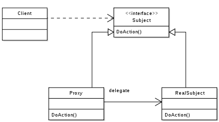

# Proxy

引用维基百科：

​	所谓的代理者是指一个类别可以作为其它东西的接口。代理者可以作任何东西的接口：网络连接、内存中的大对象、文件或其它昂贵或无法复制的资源。

著名的代理模式例子为[引用计数](https://zh.wikipedia.org/wiki/%E5%8F%83%E7%85%A7%E8%A8%88%E6%95%B8)（英语：reference counting）指针对象。

​	当一个复杂对象的多份副本须存在时，代理模式可以结合[享元模式](https://zh.wikipedia.org/wiki/%E4%BA%AB%E5%85%83%E6%A8%A1%E5%BC%8F)以减少内存用量。典型作法是创建一个复杂对象及多个代理者，每个代理者会引用到原本的复杂对象。而作用在代理者的运算会转送到原本对象。一旦所有的代理者都不存在时，复杂对象会被移除。

​	具体实例参考 proxy.go